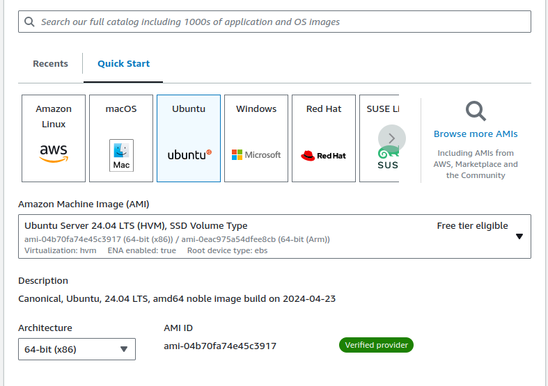
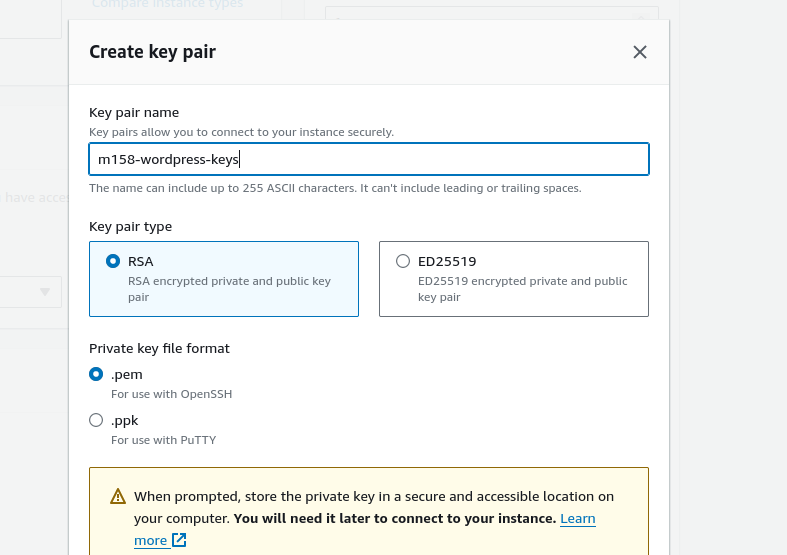

# Dokumentation M158 Praxisarbeit

## zuerst habe ich das Learner Lab gestartet auf AWS

## Umgebung aufbauen / einrichten 

 
 
 

 
## via SSH verbinden
 

## mit superuser einloggen und ein update

## nala installieren (als schnellerer wrapper von apt)

## nginx Webserver installieren

## mysql DB-server installieren

## mysql konfigurieren

## DB-User für wordpress 

## DB-Login testen

## DB für Wordpress erstellen

## PHP installieren

## PHP restart

## Nginx konfigurieren

## DNS eintrag auf www.duckdns.org

## Nginx Konfiguration Domain anpassen

## Nginx restart
 

## erster Test im Browser

## nochmals Nginx Konfigurationsdatei anpassen

## PhpMyAdmin installieren

## PhpMyAdmin Dateien verlinken 

## PhpMyAdmin erstes Login
